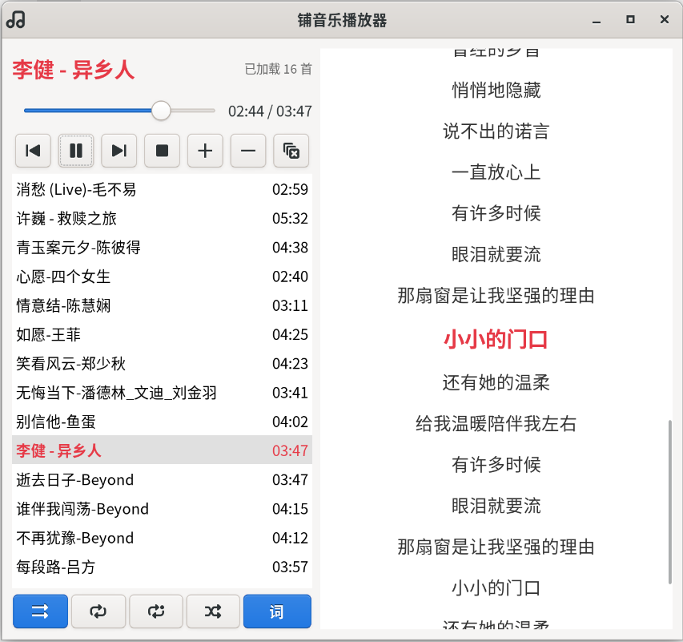

# 铺音乐播放器 / PooMusic

一个简单的 Gtk 音乐播放器。

### 依赖
```
# Python GTK 核心组
python3-gi-cairo
gir1.2-gtk-3.0
adwaita-icon-theme

# GStreamer 多媒体组（音视频）
python3-gst-1.0
gstreamer1.0-plugins-good
gstreamer1.0-plugins-ugly

# UPnP / 网络播放组
libgupnp-igd-1.6-0

# VA-API 硬件加速（视频硬解）
libva-drm2
libva2

# 歌曲信息获取
python3-mutagen
```

### 运行
```
python3 PooMusic.py
```

### 展示
